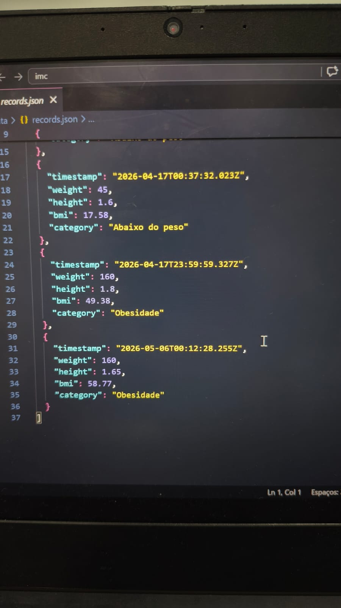

# Projeto Acadêmico - Calculadora de IMC

Este repositório contém um sistema desenvolvido na **ETEC Albert Einstein** para cálculo de **Índice de Massa Corporal (IMC)**, utilizando **HTML, CSS e JavaScript** no frontend e **Express.js** no backend para persistência dos resultados em arquivo JSON.

## Funcionalidades
- Entrada de dados: **peso (kg)** e **altura (m)**.
- Botão para calcular o **IMC**.
- Botão para salvar os resultados em `data/records.json`.
- Mensagens de classificação:
  - `Abaixo do peso` para IMC < 18.5
  - `Peso normal` para 18.5 <= IMC < 24.9
  - `Sobrepeso` para 24.9 <= IMC < 29.9
  - `Obesidade` para IMC >= 29

## Estrutura do Projeto
- `app.js` — Servidor **Express** responsável pelo backend.
- `public/` — Arquivos do frontend (HTML, CSS e JavaScript).
- `data/records.json` — Arquivo para armazenamento dos resultados.

## Demonstração
<p align="center">
  
  
  
</p>

## Tecnologias Utilizadas
- **HTML5**  
- **CSS3**  
- **JavaScript (ES6+)**  
- **Node.js / Express.js**  
- **GitHub** para versionamento e controle de código

## Diferenciais Técnicos
- Integração entre **frontend** e **backend**.  
- Persistência de dados em formato **JSON**.  
- Estrutura modular e organizada para fácil manutenção.  
- Demonstração prática de conceitos de **desenvolvimento full-stack**.  

## Como Executar
1. Certifique-se de ter o **Node.js** instalado em sua máquina.
2. Clone este repositório:
   ```bash
   git clone https://github.com/seu-usuario/BMI-calculator.git
